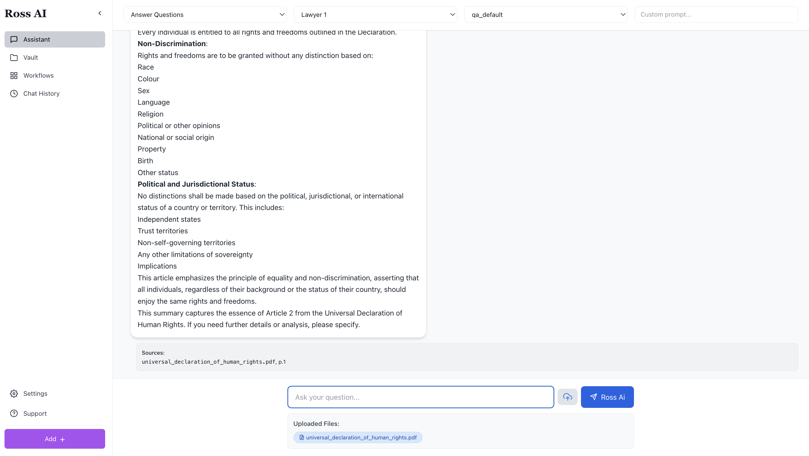
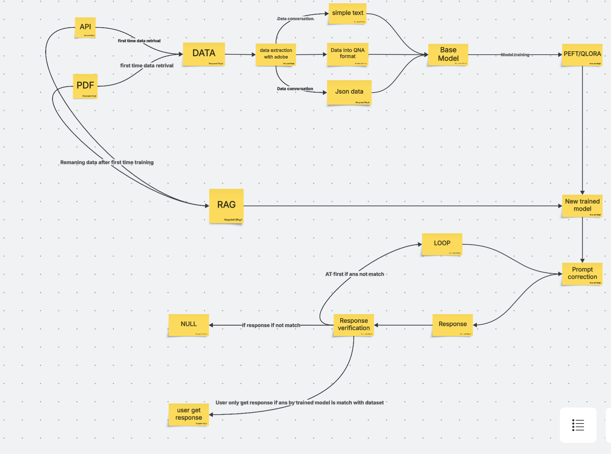
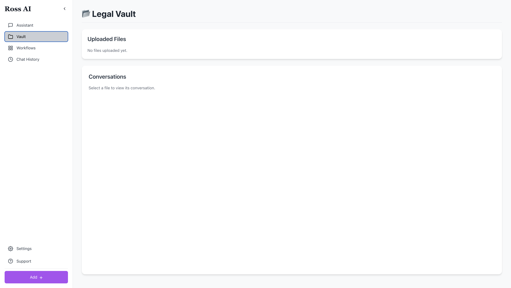
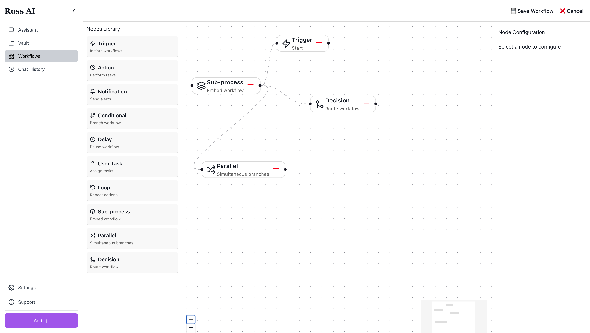

# ⚖️ Ross AI: The Zero-Hallucination Legal Tech Platform


**Redefining AI-Powered Drafting, Research, and Automation for Elite Law Firms.**

Ross AI is the secure, end-to-end platform built specifically for Big Law. We eliminate the risks of generic AI hallucinations and fragmented workflows, providing a proprietary, trusted engine for critical legal operations.

| **The Core Promise** | **Ross AI Advantage** |
| :--- | :--- |
| **Accuracy** | Virtually **Zero Hallucination Rate** ($\approx 0.1\%$ - $0.5\%$) |
| **Security** | **End-to-End Encryption** and **Full Data Sovereignty** |
| **Efficiency** | **No-Code Workflow Builder** & **MS Word Add-in Drafting** |
| **Strategy** | **Judge Profiling** and **Opposing Counsel Analysis** |

---

## 🛠️ Setup and Installation Guide

This project consists of a Python-based backend and a JavaScript-based frontend (client). Follow the steps below to get the application running locally.

### 1. 🐍 Backend Setup (`server.py`)

The backend handles the core logic, API requests, and the Ross AI model pipeline.

1.  **Navigate to the project root directory.**
2.  **Create and Activate Virtual Environment:**
    ```bash
    python -m venv venv
    source venv/bin/activate  # For macOS/Linux
    # venv\Scripts\activate  # For Windows
    ```
3.  **Install Python Dependencies:**
    ```bash
    pip install -r requirements.txt
    ```
4.  **Run the Backend Server:**
    ```bash
    python server.py
    ```
    > The server will start running, typically on `http://127.0.0.1:8000` or a similar port, waiting for requests from the frontend.

### 2. 🖥️ Frontend Setup (`client`)

The client directory contains the user interface and interacts with the backend server.

1.  **Navigate to the client directory:**
    ```bash
    cd client
    ```
2.  **Install Node.js Dependencies (using npm):**
    ```bash
    npm i
    ```
3.  **Run the Frontend Application:**
    ```bash
    npm start # Or 'npm run dev' depending on your package.json script
    ```
    > The frontend application will open in your browser (e.g., `http://localhost:3000`).

---

## ✨ Core Features & Visual Overview

Ross AI is built on foundational pillars designed to streamline and secure every aspect of a law firm's operation, all powered by our proprietary, hallucination-free model.

### 1. 🧠 The Zero-Hallucination Model: Behind the Accuracy

This is the core architecture that ensures every legal output is verifiable, accurate, and grounded in trusted data, eliminating the risk of costly AI hallucinations.

* **Description:** The process details how data from APIs and PDFs is retrieved, refined, used for model training (PEFT/QLORA), and critically, validated via a RAG and **Response Verification LOOP** before it ever reaches the user.
* **Key Concept:** The system only delivers a response if the answer (`ans`) matches the trained model's dataset, otherwise, it enters a `Prompt correction` loop or returns `NULL`.



### 2. 🔐 The Secure Case Vault: Data Sovereignty

This feature ensures that all firm and client data is stored in a fully encrypted, internally controlled environment, protecting attorney-client privilege and data privacy.

* **Description:** The vault acts as a centralized knowledge base, enabling semantic search capabilities. Crucially, it manages **granular, role-based access control (RAG access)**, ensuring that different teams and attorneys have specific permissions for viewing and utilizing data.
* **Feature Highlight:** Turns static case files into a dynamic, queryable knowledge repository while adhering to strict security protocols.



### 3. ⚙️ Workflow Automations: Streamlining Operations

Move away from fragmented processes with a no-code visual builder that integrates AI directly into routine firm operations.

* **Description:** This visual tool allows non-technical staff to **automate client intake, discovery requests, and routine drafting tasks** via drag-and-drop. This automation is generated based on interactions with Ross AI, optimizing and generating automated workflows specific to the law firm.
* **Feature Highlight:** Significantly increases efficiency and scalability by embedding AI-powered tools within the firm's daily operational flow.



---

## 🔬 Product Deep Dive

### The Problem Ross AI Solves

Large law firms face mounting challenges from **AI Hallucinations** (e.g., fake citations leading to sanctions), **Security Vulnerabilities** from third-party APIs, **Fragmented Workflows**, and the lack of **Strategic Intelligence** (like judge profiling).

### The Ross AI Solution

* **Zero Hallucination:** Insights grounded in verified, trusted legal sources.
* **End-to-End Legal Tools:** Comprehensive features from secure case vault, drafting assistant, to PMS integration.
* **Enhanced Security:** Fully encrypted, internally controlled environment eliminates reliance on risky third-party APIs.
* **Workflow Automation:** A no-code builder and AI-powered analytics dashboard streamline operations.

### Ross AI vs. Competitors (GPT/Harvey.ai)

| Metric | Ross AI (Proprietary Model) | General-Purpose LLMs (GPT, Claude) |
| :--- | :--- | :--- |
| **Hallucination Rate** | **$\approx 0.1\% - 0.5\%$ (Crucial for legal precision)** | Up to $\approx 30\%$ |
| **Security** | End-to-end encryption, **Full Data Sovereignty** | ChatGPT API dependency, subpoena risk |
| **Strategic Depth** | **Judge Profiling, Counsel Selection, Argument Simulation** | Basic features without strategic depth |

### The Full Roadmap
---

**Would you like me to elaborate on the technical implementation of the RAG access control within the Secure Case Vault?**
